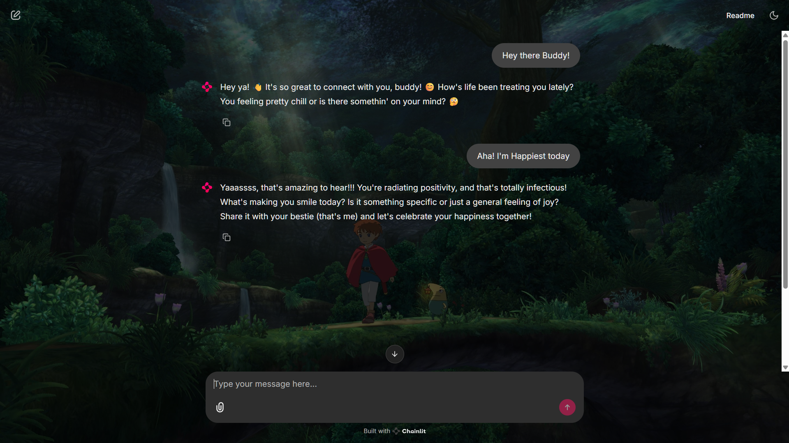

# Ashley - Your Kawaii Mental Health Companion 🌸


## Overview 💫

Ashley is my passion project - a kawaii-styled mental health chatbot designed to be your digital companion. Built with Chainlit and powered by Groq's advanced language model, Ashley provides empathetic responses and creates a safe space for comforting conversations.


## Features 🌟

- 💕 Kawaii-themed interface for a friendly, approachable experience
- 🎭 Advanced sentiment analysis to understand your emotions
- 💬 Real-time chat with empathetic responses
- 🎨 Customizable layout with styled components
- 🤝 Engaging conversations that feel personal and meaningful

## Technologies Used 🛠️

### Frontend

- React (for building our beautiful UI)
- Bootstrap (for responsive design)
- React Icons (for kawaii visual elements)
- React Router DOM (for seamless navigation)
- Typewriter Effect (for engaging animations)
- React Parallax Tilt (for interactive elements)
- Web Vitals (for performance monitoring)

### Backend

- Chainlit (for creating our chat interface)
- Groq API (powering Ashley's intelligent responses)
- TextBlob & NLTK (for sentiment analysis)
- LangChain (for conversation management)
- Python dotenv (for secure configuration)

## Getting Started 

### Prerequisites

- Python (v3.7 or higher)
- Node.js (v14 or higher)
- Groq API Key

### Installation

1. **Clone the repository:**

    ```bash
    git clone https://github.com/your-username/kawaii-chatbot.git
    cd kawaii-chatbot
    ```

2. **Install frontend dependencies:**

    ```bash
    cd client
    npm install
    ```

3. **Install backend dependencies:**

    ```bash
    cd ../chatbot/ashBot
    pip install -r requirements.txt
    ```

4. **Set up your environment:**

   Create a `.env` file in the ashBot directory:

    ```env
    GROQ_API_KEY=your_groq_api_key
    ```

## Running Ashley 



### Frontend

```bash
cd client
npm start
```

### Backend

```bash
cd chatbot/ashBot
chainlit run app.py
```

## Project Structure 📁

```
kawaii-chatbot/
├── client/              # React frontend
├── chatbot/
│   └── ashBot/         # Chainlit backend
├── images/             # UI assets
└── README.md
```

## Development Scripts 🛠️

### Frontend

- `npm start`: Launch development server
- `npm run build`: Create production build
- `npm test`: Run tests
- `npm run eject`: Eject CRA configuration

### Backend

- `chainlit run app.py`: Start the Chainlit application

## Contributing 

Feel free to contribute to making Ashley even better! Whether it's adding new features, improving responses, or enhancing the kawaii aesthetics, all contributions are welcome!


