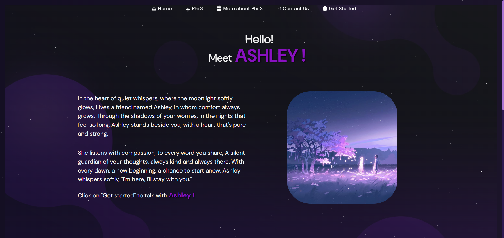
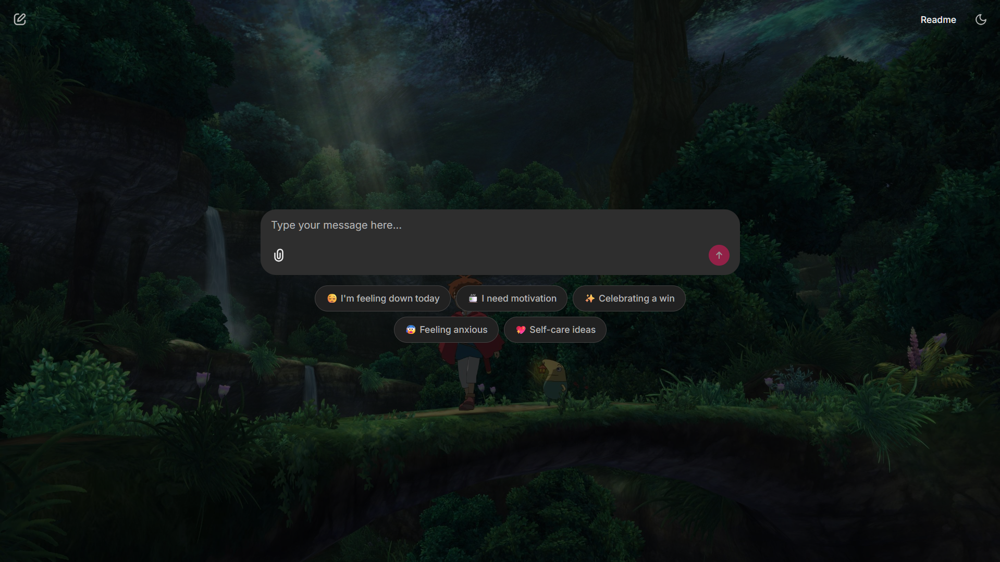

# Mental Health Chatbot

## Overview

Ashley is a mental health chatbot designed to offer support and companionship to users. Built with Streamlit and leveraging the Hugging Face Phi-3 model, Ashley provides empathetic responses and engages users in comforting conversations.

## Table of Contents

- [Features](#features)
- [Technologies Used](#technologies-used)
- [Getting Started](#getting-started)
- [Running the Application](#running-the-application)
- [Scripts](#scripts)
- [Dependencies](#dependencies)
- [License](#license)

## Features

- Empathetic and supportive responses
- Sentiment analysis to tailor responses
- Customizable layout with styled components
- Real-time chat interactions

## Technologies Used

### Frontend

- React
- Bootstrap
- React Icons
- React Router DOM
- Typewriter Effect
- React GitHub Calendar
- React Parallax Tilt
- Web Vitals

### Backend

- Streamlit
- Hugging Face API
- LangChain
- TextBlob
- dotenv

## Getting Started

### Prerequisites

- Python (v3.7 or higher)
- Node.js (v14 or higher)
- Hugging Face API Key

### Installation

1. **Clone the repository:**

    ```bash
    git clone https://github.com/your-username/chatbot.git
    cd chatbot
    ```

2. **Install frontend dependencies:**

    ```bash
    cd client
    npm install
    ```

3. **Install backend dependencies:**

    ```bash
    cd ../server
    pip install -r requirements.txt
    ```

4. **Create a `.env` file in the server directory and add the following:**

    ```env
    HF_API_KEY=your_hugging_face_api_key
    ```

## Running the Application

### Frontend

1. **Start the React development server:**

    ```bash
    cd client
    npm start
    ```

### Backend

1. **Start the Streamlit application:**

    ```bash
    cd server
    streamlit run app.py
    ```

## Scripts

### Frontend

- `npm start`: Starts the development server.
- `npm run build`: Builds the application for production.
- `npm test`: Runs the tests.
- `npm run eject`: Ejects the Create React App configuration.

### Backend

- `streamlit run app.py`: Starts the Streamlit application.

## Dependencies

### Frontend

- **Production Dependencies**:
  - `@react-pdf/renderer`
  - `axios`
  - `bootstrap`
  - `react`
  - `react-dom`
  - `react-github-calendar`
  - `react-icons`
  - `react-parallax-tilt`
  - `react-router-dom`
  - `react-tsparticles`
  - `typewriter-effect`
  - `web-vitals`
- **Development Dependencies**:
  - `@testing-library/jest-dom`
  - `@testing-library/react`
  - `@testing-library/user-event`

### Backend

- `streamlit`
- `huggingface_hub`
- `textblob`
- `langchain`


- `python-dotenv`

## License

This project is licensed under the ISC License.
